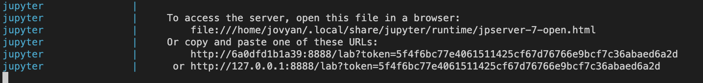
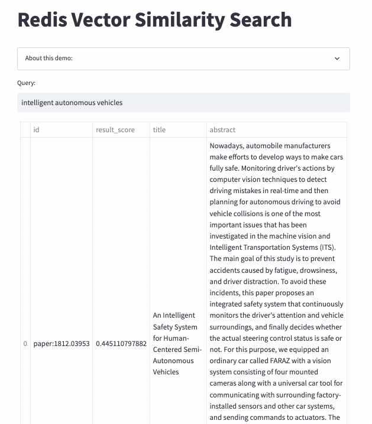

<div align="center">
    <a href="https://github.com/RedisVentures/redis-vecsim"></a>
    <br />
    <br />
<div display="inline-block">
    <a href="https://ecommerce.redisventures.com"><b>eCommerce Demo</b></a>&nbsp;&nbsp;&nbsp;
    <a href="https://docsearch.redisventures.com"><b>Docsearch Demo</b></a>&nbsp;&nbsp;&nbsp;
    <a href="https://redis.io/docs/stack/search/reference/vectors/"><b>Redis VSS Documentation</b></a>&nbsp;&nbsp;&nbsp;
  </div>
    <br />
    <br />
</div>

# Getting Started: **Redis Vector Similarity**
This entry-level tutorial is meant to guide you through:
- Setting up a RediSearch + Jupyter + Streamlit docker stack
- Creating text-based embeddings (vectors) from a sample/toy dataset
- Storing vector data in RediSearch
- Running vector queries and hybrid queries
- Hosting a simple Streamlit UI

___

**WARNING -- this is a toy example/demo**. This is not meant to replicate production in any way. Rather, use this to learn the basics to apply to your own data and pipelines.

## Docker Setup
Make sure you have Docker Desktop installed on your workstation.

Run this command to start up the stack of services including Redis and Jupyter:
```bash
$ docker compose up
```

Run this command to tear down the stack:
```bash
$ docker compose down
```

If at any point you need to trouble shoot, run this command to check running docker processes:
```bash
$ docker ps -a
```

Check logs of a docker container with the id found in last step:
```bash
$ docker logs {CONTAINER_ID} -f
```

## Jupyter Notebook
We use Jupyter notebooks here to guide through the tutorial of loading data, creating embeddings, storing in Redis, and creating a search Schema.

After running the `docker compose up` step, you should see a link in the logs like this:



Use the last URL listed... the one that has your own custom token -- not this exact one :)

## Streamlit
We've included a sample [Streamlit UI](http://localhost:8501/) that allows you to enter a search query and explore a subset of documents with AI-powered vector similarity search.

The UI can be extended or modified to fit your schema and usecase. This just gives you a starting point!




> WARNING: Streamlit app only works once the data has been loaded to Redis. Use the Jupyter notebook for that (see above). Refresh the app once dataset is in Redis.

## Full Example
See our arXiv paper search demo/example that includes a full front end and backend system if you're ready for the next step.

